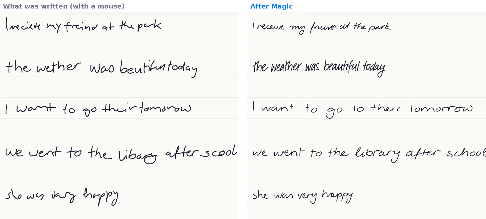
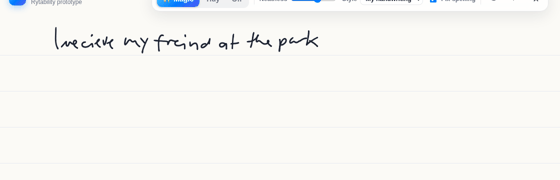
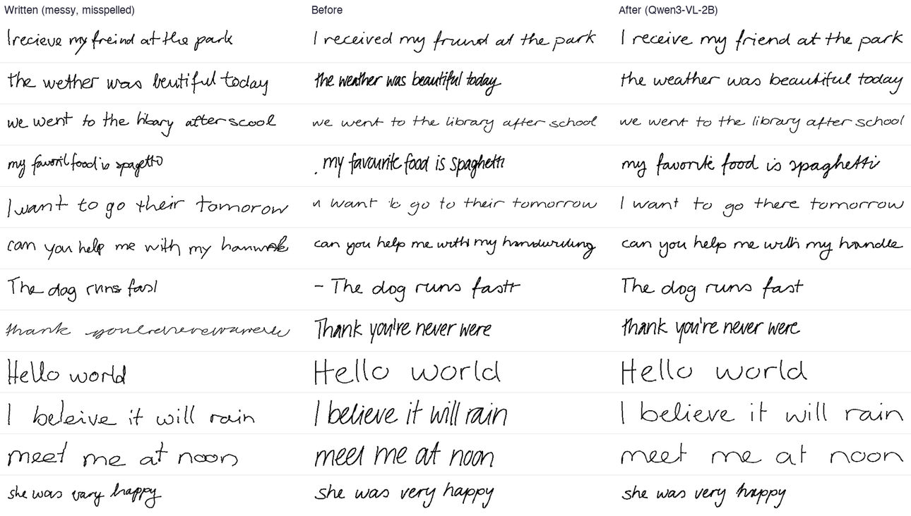

# Rytability Handwriting Magic (proof of concept)

Write with a mouse, a trackpad or an Apple Pencil, then press **✨ Magic**. Your scrawl
shimmers, dissolves into sparkles, and the same sentence writes itself back in.
It comes back **neat, spelled correctly, and still in your handwriting**.





This is a standalone prototype for the iPad version of Rytability. Everything
runs locally on your Mac. The only network traffic is the one-time model download.

## Try it on your Mac

```bash
git clone https://github.com/Rybib/Handwriting-Fixing-System
cd Handwriting-Fixing-System
./run.sh
```

After that, just double-click **Launch Handwriting Magic.command** in the folder.
If anything goes wrong, the launcher saves everything it printed to
`logs/last-run.log`, and `./run.sh --reset` rebuilds the Python environment
from scratch. If the AI packages can't be installed, it still starts, as a
plain drawing page.

The first run sets up a Python environment, installs PyTorch and Transformers
(about 1 GB), then downloads the models: the handwriting reader (Qwen3-VL-2B,
about 4.5 GB) and the 43 MB handwriting synthesiser. The Terminal and the status in
the bottom-right corner of the page show the download's progress; you can
write meanwhile, and press Magic once the dot turns green. After that, `./run.sh` opens the demo
in your browser within a few seconds, normally at `http://127.0.0.1:8765`. If
another program is using that port, it takes the next free one. It needs Python 3.10 or newer. If it
can't find one, it installs [uv](https://docs.astral.sh/uv/), which fetches
Python for you (no admin rights needed).

**Test with a real Apple Pencil:** run `./run.sh --lan`, then open the printed
`http://<your-mac-ip>:8765` address in Safari on an iPad on the same Wi-Fi.
Pencil pressure is used for line width, and palm rejection is on.

**Or as an app on your iPhone or iPad:** the
[`ios` branch](https://github.com/Rybib/Handwriting-Fixing-System/tree/ios) is an
Xcode project that runs this same page with the whole pipeline on the device
(Google ML Kit reads the strokes, Qwen3-VL-2B via MLX works out what was meant;
no Mac needed). See its README.

### Controls

| | |
|---|---|
| **✨ Magic / Enter** | Reads everything written since the last press, works out what you meant, fixes the spelling, and rewrites it neatly in your handwriting. Nothing changes until you press it, so it never rewrites a sentence you're still in the middle of |
| **Neatness** | How neat the rewrite is (the synthesiser's sampling bias) |
| **Style** | *My handwriting* copies your style, and switches to *Tall narrow print* for any line where the copy reads worse; the card under the page says so. The 13 named styles, from *Clean print* to *Flowing cursive*, are other writers from the training data |
| **Fix spelling** | Off: Magic rewrites exactly what you wrote, just neater |
| **👁 / hold Space** | Shows what you originally wrote |
| **↶ / ⌘Z** | Undoes the last stroke or the last fix |

## How it works

```
 pointer / Pencil events
        │
        ▼
 ① Ink Stroke Modeler (JS port)         live: spring-mass pen model + wobble smoothing
        │                                → smooth, low-latency, variable-width ink
        ▼  (press ✨ Magic)
 ② Line + word segmentation, tidying     pure geometry, instant: the tidied ink is
        │                                the style sample for ④
        ▼
 ③ Reader: Qwen3-VL-2B (local)           one pass returns (with macOS Vision's literal
        │                                reading as a second opinion)
        │                                  WRITTEN: "I recieve my freind at the park"
        │                                  MEANT:   "I receive my friend at the park"
        ▼
 ④ Handwriting synthesis (Graves RNN)    primed with YOUR tidied ink + its transcript,
        │                                writes MEANT in your style, and in a clean
        │                                built-in style: 8 candidates of each
        ▼
 ⑤ Self-check                            macOS Vision proofreads the candidates; the
        │                                first one that reads back perfectly in your
        │                                style wins, else the clean style's best
        ▼
 ⑥ Magic animation                       scrawl dissolves, neat ink writes itself in
```

* **① [Ink Stroke Modeler](https://github.com/google/ink-stroke-modeler)**, one of
  the two projects you suggested. It's Google's real-time stroke smoother. I ported
  its wobble smoother, spring-mass position modeler, upsampling and end-of-stroke
  catch-up to JavaScript (`web/js/inkmodeler.js`). It removes mouse jitter while
  you draw, without lag.
* **③ Reader.** A small on-device vision-language model is prompted to give both a
  literal reading and the intended sentence. Because it sees the pixels and knows
  English, it can resolve "wether" → "weather" and "their tomorow" →
  "there tomorrow".
* **④ Synthesis.** [Graves (2013)](https://arxiv.org/abs/1308.0850) handwriting
  synthesis, using the pretrained weights from
  [sjvasquez/handwriting-synthesis](https://github.com/sjvasquez/handwriting-synthesis),
  re-implemented in pure numpy (`server/synth.py`, no TensorFlow). Its "priming"
  mechanism is what makes the output look like *you*. It first feeds your own
  strokes and their transcript through the network, then continues writing in
  that style.
* **⑤ Self-check.** Priming copies whatever it is shown, and that includes
  illegibility. The server checks that the network's attention lined up with
  your ink, then has macOS Vision read the candidates back literally (about 40 ms
  each; the VLM was too forgiving, because it reads *through* a garbled letter).
  Your style is kept only if one of its versions reads back at least as well as
  the clean built-in style. Both are generated in the same batch, so this adds
  well under a second. Without macOS Vision, the VLM proofreads the top two.
* **Clean-up of the pen's path.** Right after priming, the network sometimes
  finishes *your* sample first (it dots your last i), which used to leave a stray
  mark before the first word; those strokes are dropped. The text also gets a
  trailing space, so the pen has its usual end-of-word moment to cross the last t
  (it used to write "fasl" for "fast"), and anything it writes after that, beyond
  the last word, is dropped.

## What I researched, and why this stack

| Candidate | Verdict |
|---|---|
| **Ink Stroke Modeler** (your pick) | ✅ Used for live smoothing. It's excellent at what it does, but it only smooths. It doesn't change letter shapes, so on its own it can't fix messy writing |
| **InkSight** (your pick) | ❌ Not used. It converts *photos* of handwriting into digital ink (derendering), and its output traces the original, mess included. We already have the digital ink. Its recognition is a side feature, and it needs TensorFlow + tensorflow-text, which are awkward on Apple Silicon |
| **Apple Smart Script** (iPadOS 18+) | The closest product to this idea, but it has no public API |
| **PencilKit `PKStrokeRecognizer`** (iPadOS/macOS 27, WWDC26) | ⭐ The production answer for step ③ on iPad: on-device stroke recognition in 29 languages, per-stroke IDs, no model to ship. `--reader apple` approximates it on the Mac with the Vision framework |
| **Graves RNN synthesis** | ✅ Used. It's tiny (3.6M parameters, 14 MB) and fast on CPU, supports style priming, and runs easily in Core ML |
| **DiffInk** (ICLR 2026) and other diffusion ink models | Better style fidelity in the papers, but trained on Chinese only. Worth watching |
| **TrOCR** | Older OCR model. It has tokenizer breakage on current Transformers, and a VLM beats it on messy lines |
| **Qwen3-VL-2B / 4B** | ✅ 2B is the default: with macOS Vision's second opinion it reads as well as 4B (19 of 24 lines each) at half the size and time. `HWFIX_VLM=Qwen/Qwen3-VL-4B-Instruct` for 4B. The iPhone/iPad app runs the same 2B model (4-bit MLX, 1.8 GB), which reads just as well (18-19/24) |
| **macOS Vision** (`VNRecognizeTextRequest`) | ✅ Proofreads the rewrites and gives the VLM a second opinion (it lifted 2B from 14 to 19 of 24 lines). `--reader apple` uses it as the reader, with the VLM fixing the text: fastest (0.7 s a line) but less accurate (15-17/24) |

### Measured results on an M5 MacBook Pro (32 GB)

12 deliberately messy test lines (sloppy writing + mouse wobble + dyslexic
misspellings, `tests/make_evalset.py`), each rewritten twice through the whole
pipeline with `tests/eval_pipeline.py`, and read back by Qwen3-VL-4B. "Browser"
is the same ink drawn through the page with an emulated mouse, which is harder
to read.

| | original version | now |
|---|---|---|
| Reader got the intended sentence (eval ink / browser ink) | 7/12 / 7/12 | **10/12 / 9/12** |
| Rewrite reads back exactly as intended (eval / browser) | 54% / 58% | **83% / 75%** |
| Lines kept in the writer's own style (eval ink) | 62% | **88%** |
| Time per line (read + write + proofread) | 2.0 s | 1.8 s |

Both use Qwen3-VL-2B. (Qwen3-VL-4B got 11/12 and 8/12, at 2.7 s a line.)



The remaining misses are the reader's: a near-illegible scribble ("thank
youreverywhere"), "homwork" (drawn as "hanwak") read as "handle", and
"favoril food" as "fruit food". Loading takes about 10 s from the cache.

Benchmarks and test tooling are in `tests/`: `make_evalset.py`,
`eval_pipeline.py` (the numbers above), `eval_legibility.py`, and
`e2e_playwright.py`, which drives the real UI with an emulated mouse. The quick
checks run in a few seconds:

```bash
node tests/test_tidy.mjs
.venv/bin/python tests/test_core.py
```

## Honest limitations

* **English only.** The synthesiser's alphabet has no capital Q, X or Z, so
  those are written lowercase.
* The synthesiser still sometimes wobbles on a letter. The best-of-3 selection
  and the self-check reduce this, but don't remove it.
* Reading is the weakest link. The reader occasionally "fixes" a word into the
  wrong real word ("handle" for a scrawled "homework"). In the real app, Gemma 3
  4B (already bundled) could do the MEANT step.
* *My handwriting* faithfully copies how you shape letters, so a loopy "it will"
  stays loopy as long as it still reads correctly.
* Drawings and diagrams aren't detected. If the reader can't find any letters,
  the ink is left alone.

## Path into Rytability (iPad)

1. **Input:** `PKCanvasView`, which already gives you Apple's own stroke smoothing.
   The JS Ink Stroke Modeler only matters for the web demo.
2. **Read:** `PKStrokeRecognizer` (iPadOS 27) for WRITTEN, then the app's existing
   Gemma 3 / Apple Foundation Models text pipeline for MEANT. This is the same
   job as Improve, with a prompt aimed at handwriting.
3. **Rewrite:** convert `server/synth.py` to Core ML or MLX. It's only an LSTM
   with 3.6M parameters, and priming uses the `PKStroke` points. (Done: the
   iPhone/iPad app in `~/Desktop/HandwritingMagic-iOS` runs it in Swift.) The
   tidying that prepares the style sample is about 200 lines of geometry.
4. **Licensing (important before shipping):** the pretrained synthesis weights come
   from a repo with **no licence**, and were trained on **IAM-OnDB**, which is
   licensed for non-commercial research only. That's fine for a proof of concept.
   For the App Store, retrain the same small network on data you can use
   commercially, for example handwriting collected from consenting users or
   licensed from a vendor. Ink Stroke Modeler and Qwen3-VL are Apache-2.0.

## Repo layout

```
run.sh                 one-command launcher (macOS / Linux)
server/app.py          local web server + /api/rewrite pipeline
server/synth.py        Graves handwriting synthesis in numpy (priming, bias, best-of-N)
server/weights.py      fetches + converts the pretrained checkpoint (no TensorFlow)
server/recognize.py    readers: Qwen3-VL (default), Apple Vision (macOS)
server/ink.py          rasterising + measuring ink
web/js/inkmodeler.js   Ink Stroke Modeler port
web/js/tidy.js         line/word segmentation, x-height/baseline/slant, Tidy beautifier
web/js/app.js          canvas, input, magic animations, UI
tests/                 eval set generator, legibility benchmark, Playwright end-to-end
```
